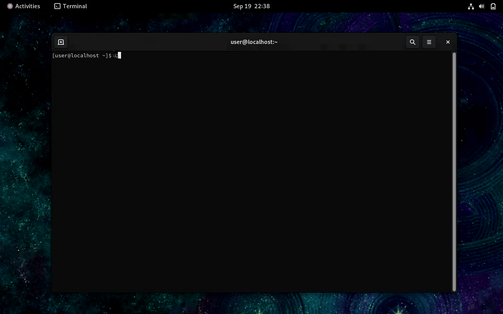

# RustyTux

RustyTux is a Linux kernel local privilege-escalation exploit for a strparser
race [publicly disclosed on the Linux kernel mailing list](https://lore.kernel.org/all/aZgpkyTDU3aXe_V0@v4bel/).
It targets an ESP-in-TCP use-after-free race in which an active receive parser
overlaps with socket teardown and rearms strparser's `msg_timer_work` after
`strp_done()` has canceled it.
This exploit is timing-sensitive and non-deterministic; race delays must be
tuned for each target environment.

The exploit attempts to derive the randomized kernel base through an x86
prefetch timing side channel, race ESP-in-TCP receive parsing against socket
teardown, and reclaim the freed `espintcp_ctx` with user-key payloads.

Race timelines can be found [here](docs/race-timelines.md), and the callback
gadget is documented [here](docs/delta.md).

### Target

As of September 2026, the race is present in the standard kernels shipped by
multiple major Linux distributions, including CentOS Stream 9 and Ubuntu 26.04
LTS.
It is reachable by an unprivileged local user without Linux capabilities.

The included offsets and callback shape target this CentOS Stream 9 build:

    CentOS Stream 9
    kernel-core-5.14.0-745.el9.x86_64

Porting the exploit requires updating its kernel-build-specific offsets and
constants, plus adapting the final `modprobe_path` trigger.

### Usage

Run the exploit as an ordinary unprivileged user:

    ./exploit

By default, the exploit tries predefined timings for socket close and delivery
of the final, timer-arming partial frame. The schedule starts with later
socket-close delays and progressively shortens them, while the final-frame delay
remains within a small preset range. `--fixed-timing` repeatedly uses only the
default timing pair, while `--aggressive` extends the schedule with earlier
close timings. `--max-windows N` limits the number of race windows (`0` is
unbounded), and `--quiet` reduces status output. Run `./exploit --help` for the
complete option summary.

The replacement timer callback attempts to change `modprobe_path` to `/tmp/.x`.
The exploit then attempts to invoke the helper, create a setuid shell at
`/tmp/rootsh`, and execute:

    /tmp/rootsh -p

### Building

The build is static and uses the sources under `src/`:

    make
    make exploit
    make prefetch
    make clean

`make` and `make exploit` build the exploit. The separate `prefetch` target
builds the KASLR helper as a standalone diagnostic binary.

### Outcomes

The exploit exits before starting the race if it cannot leak the kernel base.
With a valid kernel base and successful heap reclaim, it attempts local
privilege escalation. A crash-only variant can omit the KASLR leak and use the
same race as an unprivileged kernel denial of service.

### Disclaimer

The exploit in this repository is provided strictly for educational and
research purposes. The author does not endorse or encourage unauthorized access
to systems.
