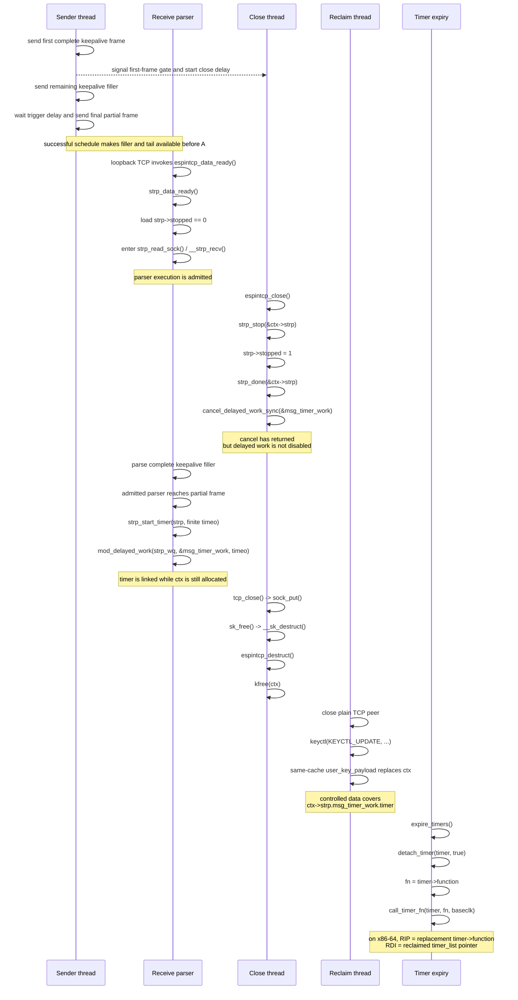
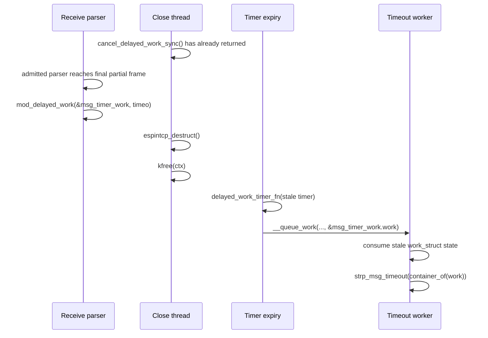
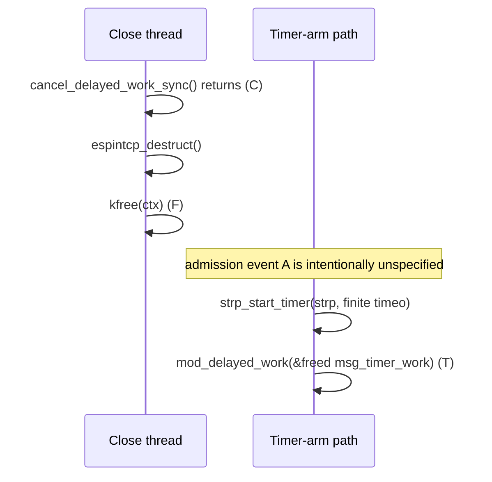
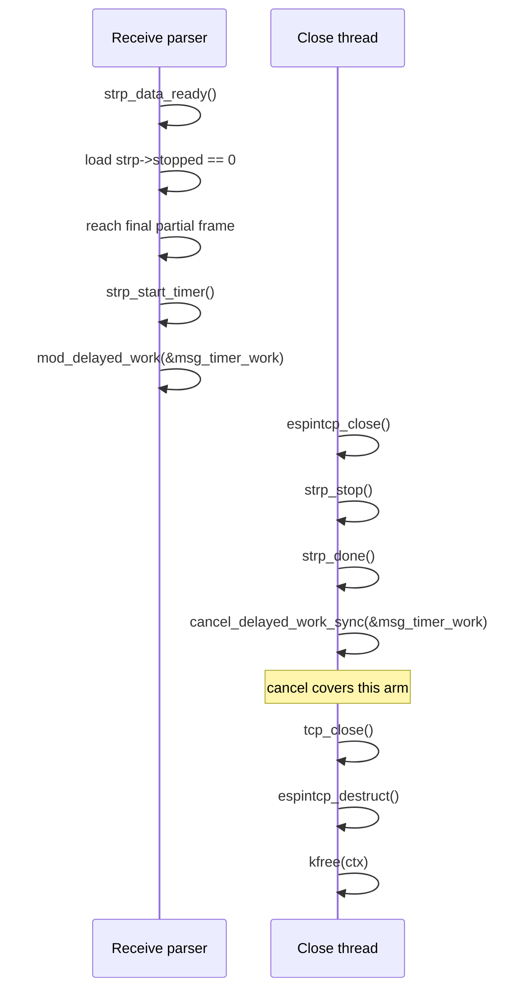
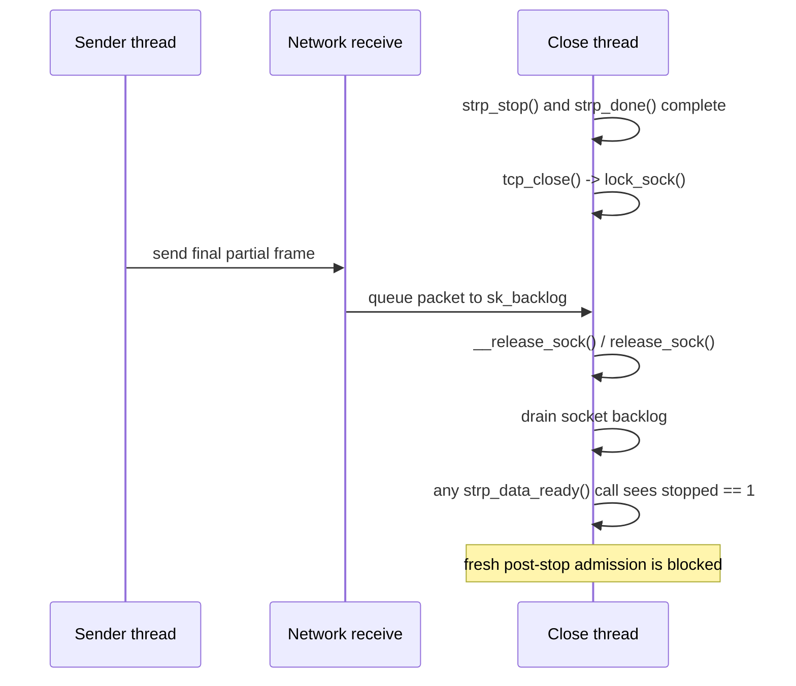

# ESP-in-TCP `msg_timer_work` Race Timelines

Each lane has one role; its execution context is stated separately:

- **Sender thread** runs in process context and sends loopback TCP data.
- **Receive parser:** In the target race, NET_RX softirq calls
  `espintcp_data_ready()` and then `strp_data_ready()`. It passes the
  `stopped == 0` check (event `A`) while no process thread owns the target
  socket, so `strp_data_ready()` calls `strp_read_sock()` in the same softirq
  invocation. If parsing is deferred, this direct call does not occur.
- **Network receive** represents NET_RX softirq in the blocked-admission case,
  where it queues the packet on `sk_backlog` while the close thread owns the
  target socket through `lock_sock()`. With loopback and no RPS redirection,
  the sender biases this work toward its current CPU.
- **Close thread** runs `espintcp_close()` and socket teardown in process
  context. The target timeline requires the socket refcount to reach zero with
  no outstanding write-memory reference deferring `espintcp_destruct()` beyond
  the start of reclaim.
- **Reclaim thread** is the main thread of the same process. After the sender
  and close threads join, it closes the plain peer and updates pre-created user
  keys, allocating replacement payloads.
- **Timer expiry** runs in timer-softirq context.
- **Timeout worker** runs `strp_msg_timeout()` in workqueue process context on
  `strp_wq`. It appears only in the alternative delayed-work outcome.

## Target Race: Rearm After Cancel, Expire After Free

The callback-control case links `msg_timer_work.timer` before `kfree(ctx)`,
reclaims the freed allocation with controlled timer bytes, and reaches timer
expiry in this order:

```text
A < C < T < F < R < E

A  receive parser is admitted while strp->stopped is still false
C  cancel_delayed_work_sync(&msg_timer_work) returns in the close path
T  admitted parser arms msg_timer_work after the close-side cancel
F  espintcp_destruct() frees ctx
R  user-key payload reclaims the freed ctx allocation
E  stale timer expires and reads replacement timer_list bytes
```

In this direct path, TCP holds the socket's bottom-half spinlock while
`strp_read_sock()` runs. The successful schedule therefore makes the filler and
final partial frame available to that parser invocation before event `A`; later
TCP input cannot join the same invocation while it holds the lock.



## Original Race Without Callback Replacement

If the post-cancel, pre-free rearm happens but reclaim does not replace the
timer callback, the stale timer can retain the normal
`delayed_work_timer_fn`. Expiry then queues the embedded, stale `work_struct`,
moving the UAF into workqueue processing instead of the fake-callback path.



`delayed_work_timer_fn()` derives the stale `delayed_work` from the timer and
reads its workqueue fields before queueing the embedded work. The worker then
consumes `work->data`, `work->entry`, and `work->func`; invalid stale state can
therefore fault before `strp_msg_timeout()` is reached.

## Arm-After-Free Partial Ordering

This partial ordering records a direct UAF at the delayed-work insertion site:

```text
C < F < T
```

It establishes that a receive/parser path reached `mod_delayed_work()` with
`msg_timer_work` already freed, but does not place that path's admission event.
Both the direct `strp_data_ready()` path and deferred `do_strp_work()` path check
`stopped` before calling `strp_read_sock()`, but an arm-site UAF does not show
whether that check occurred before or after `F`. Event `A` is therefore left
unordered rather than inferred from the later fault.



Arm-after-free is another consequence of the lifetime race, but it is less
suitable for callback control. Here `mod_delayed_work()` operates on
`msg_timer_work` only after its owner has been freed. It first interprets and
attempts to claim pending state from the freed or reclaimed `work_struct`. If
that succeeds, the queueing path writes delayed-work and timer state before
linking the embedded `timer_list`. A replacement object must therefore remain
coherent through workqueue state handling and timer insertion before expiry can
reach the controlled callback. In the preferred ordering, a valid timer is
already linked before `ctx` is freed.

## Benign Pre-Cancel Arm

This ordering has the same final partial-frame timer arm, but it occurs before
close reaches `strp_done()`. The close-side cancel can still see and drain it.

```text
A < T < C < F
```



## Receive-Admission Requirement

If `tcp_close()` owns the target socket when a later packet arrives, TCP queues
the packet on `sk_backlog`. The close path drains that backlog through
`__release_sock()`, both inside `__tcp_close()` and when `release_sock()` runs,
after `strp_stop()` has set `stopped = 1`. The packet is then either discarded
by TCP or delivered through the data-ready callback; in the latter case,
`strp_data_ready()` returns at the stopped check. Thus backlog delivery does not
start a new parser execution after stop.



Parsing cannot resume through deferred strparser work either. If
`strp_data_ready()` queues `strp->work`, `do_strp_work()` acquires the socket lock
and checks `stopped` before calling `strp_read_sock()`. The target
`A < C < T < F` ordering therefore requires a direct parser admitted before
`strp_stop()` to remain active until it reaches the final partial frame.
Complete keepalive filler prolongs that parser execution without leaving the
message timer armed after a frame is completed.

## Finite Receive-Timeout Requirement

Two fresh partial-frame states can reach `strp_start_timer()`:

```text
incomplete ESP-in-TCP length field
  espintcp_parse() returns 0
  __strp_recv() needs more header bytes
  strp_start_timer(strp, timeo)

complete length field, incomplete frame body
  espintcp_parse() returns the declared frame length
  __strp_recv() finds that the missing body is not in the socket buffer
  strp_start_timer(strp, timeo)
```

Neither state is sufficient by itself. `strp_start_timer()` queues
`msg_timer_work` only for a nonzero timeout other than `LONG_MAX`. The default
`sk->sk_rcvtimeo` is `MAX_SCHEDULE_TIMEOUT == LONG_MAX`, so the default does not
arm the timer. A zero timeout also bypasses `mod_delayed_work()`.
